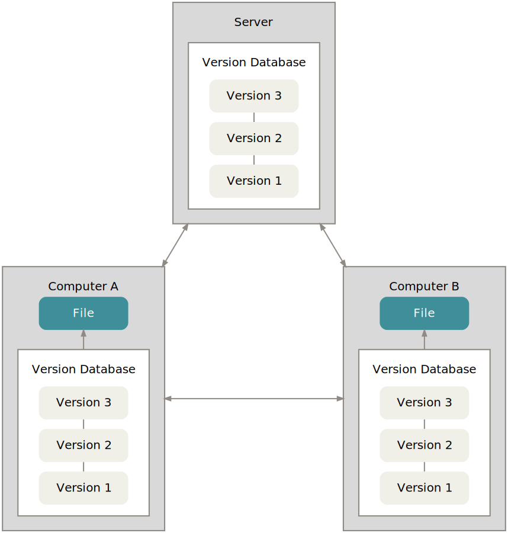
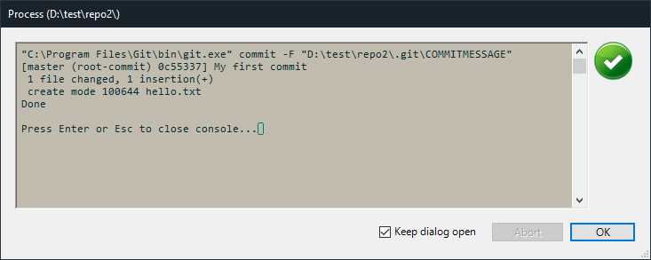
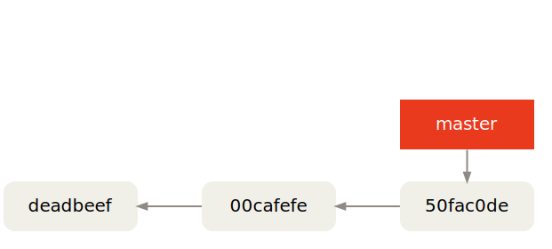
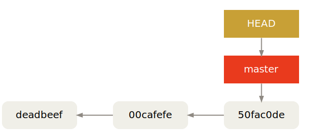
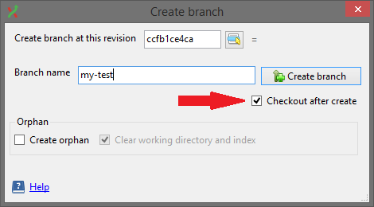
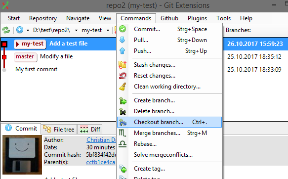
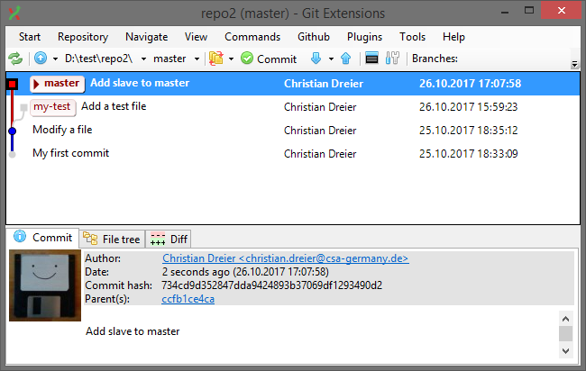
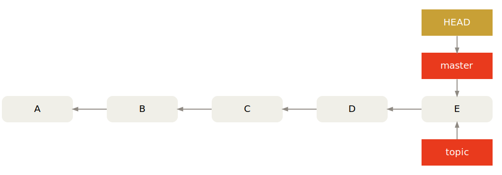

# Basics

Commit often, perfect later, publish once

## Comparison to other version control systems

Classical version control systems have one central repository that is accessed by all participants.


Each participant checks out a working copy from the central repository. Changes are committed to the central repository directly.

With Git every participant has its own full repository with all version information on his own machine.



This causes some advantages:

- There is no need to be connected to some central repository while working
- A participant can make commits, branches and can even change the version history on his local machine before he publishes his changes
- If a centralized VC repository gets lost you have better a backup. With Git and other decentralized VCSs every participant has a backup
- ...

## Working with Git

There are several graphical tools available that make it more or less easier to work with Git. But it is recommended to use the CLI to learn the basics. Many users prefer the CLI actually. One graphical Git tool that can be recommended is [Git Extensions](https://gitextensions.github.io/).

### Basic principles

Working with Git is much more easy and pleasant if you know some principles:

- All operations are done on the "current" branch (the branch that was checked out the last time).
- Most operations should be done with a clean working directory. This means that there should be no modifications since the last commit.
- As long as you did not publish your commits to a central one, you can change almost all of them. You can even change the order of the commits, split a commit or combine them (these are so called "rebase" operations). But do not such things on published commits if there is not a *very* good reason for that and even then you must discuss this with all people that work on the repository. If you do not follow this advice you and/or your colleagues will be irritated very much and you could be hated by all of them. 

### First steps

Make sure that you have the command `git` in your system PATH. The `git` command should be available after you installed [Git Extensions](https://gitextensions.github.io/). If there are problems or you want use only Git and nothing else you can get Git directly from its [Website](https://git-scm.com/).

Basic command syntax:

```
$ git <verb>
```

Get help:

```
$ git help <verb>
$ git <verb> --help
```

#### Create a new repository

```
PS D:\test\repo> git init
Initialized empty Git repository in D:/test/repo/.git/
```

##### With Git Extensions

Step1:


Step 2:


Step 3:


After that you can open the Git Extensions main window.

1:


2:


#### Add first file to repository

Add some text file to your repository directory (in this example the file is named "hello.txt" ).

Typing `git status` now will give you this output:

```
PS D:\test\repo> git status
On branch master

Initial commit

Untracked files:
  (use "git add <file>..." to include in what will be committed)

        hello.txt

nothing added to commit but untracked files present (use "git add" to track)
```

In Git Extensions you see this:


"Untracked" means that the file is not part of the repository yet. To add the file to the repository:

```
PS D:\test\repo> git add hello.txt
```

Alternatively you can type `git add .` but you should learn to use the ".gitignore" file before using this command.

To make a commit:

```
PS D:\test\repo> git commit -m "My first commit"
[master (root-commit) 15cc061] My first commit
 1 file changed, 1 insertion(+)
 create mode 100644 hello.txt
```

The repository contains now exactly one commit. Typing `git status` will give you this output now:

```
PS D:\test\repo> git commit -m "My first commit"
[master (root-commit) 15cc061] My first commit
 1 file changed, 1 insertion(+)
 create mode 100644 hello.txt
```

##### With Git Extensions

Step 1: Click on this button:


A window will open:


Step 2: Click on the button "Stage":


As seen in the image above, the file to add should be in the bottom part of the window now.

Step 3: Add a commit message and click on the button "Commit".



After confirming the message window, the Git Extensions main window should look like this:


#### Modify a file

A `git status` after a file is modified will look like this:

```
PS D:\test\repo> git status
On branch master
Changes not staged for commit:
  (use "git add <file>..." to update what will be committed)
  (use "git checkout -- <file>..." to discard changes in working directory)

        modified:   hello.txt

no changes added to commit (use "git add" and/or "git commit -a")
```

Note that Git does say nothing about "untracked" but something about "Changes not staged". It is a difference whether a file is unknown in the repository yet or a known file has modifications. The actions have to be done are similar to adding new files to the repository.

First, "stage" the file:

```
PS D:\test\repo> git add hello.txt
```

A `git status` will show that the file is ready to be committed as "modified". The actual commit is also very similar:

```
PS D:\test\repo> git commit -m "Modify a file"
[master 38b223d] Modify a file
 1 file changed, 1 insertion(+), 1 deletion(-)
```

##### With Git Extensions

Much like as the CLI, committing a modified file is very similar to committing a new file. See the description of committing a new file above.

#### Add a .gitignore file

You should add a file named `.gitignore` in the root directory of your project at the very beginning - ideally with the first commit. On [Github](https://github.com/github/gitignore) is a large collection of .gitignore files. These files cover almost all junk files that can be generated by certain languages and/or environments.

This is the ".gitignore" template for Visual Studio:

```
## Ignore Visual Studio temporary files, build results, and
## files generated by popular Visual Studio add-ons.
##
## Get latest from https://github.com/github/gitignore/blob/master/VisualStudio.gitignore

# User-specific files
*.suo
*.user
*.userosscache
*.sln.docstates

# User-specific files (MonoDevelop/Xamarin Studio)
*.userprefs

# Build results
[Dd]ebug/
[Dd]ebugPublic/
[Rr]elease/
[Rr]eleases/
x64/
x86/
bld/
[Bb]in/
[Oo]bj/
[Ll]og/

# Visual Studio 2015 cache/options directory
.vs/
# Uncomment if you have tasks that create the project's static files in wwwroot
#wwwroot/

# MSTest test Results
[Tt]est[Rr]esult*/
[Bb]uild[Ll]og.*

# NUNIT
*.VisualState.xml
TestResult.xml

# Build Results of an ATL Project
[Dd]ebugPS/
[Rr]eleasePS/
dlldata.c

# Benchmark Results
BenchmarkDotNet.Artifacts/

# .NET Core
project.lock.json
project.fragment.lock.json
artifacts/
**/Properties/launchSettings.json

*_i.c
*_p.c
*_i.h
*.ilk
*.meta
*.obj
*.pch
*.pdb
*.pgc
*.pgd
*.rsp
*.sbr
*.tlb
*.tli
*.tlh
*.tmp
*.tmp_proj
*.log
*.vspscc
*.vssscc
.builds
*.pidb
*.svclog
*.scc

# Chutzpah Test files
_Chutzpah*

# Visual C++ cache files
ipch/
*.aps
*.ncb
*.opendb
*.opensdf
*.sdf
*.cachefile
*.VC.db
*.VC.VC.opendb

# Visual Studio profiler
*.psess
*.vsp
*.vspx
*.sap

# Visual Studio Trace Files
*.e2e

# TFS 2012 Local Workspace
$tf/

# Guidance Automation Toolkit
*.gpState

# ReSharper is a .NET coding add-in
_ReSharper*/
*.[Rr]e[Ss]harper
*.DotSettings.user

# JustCode is a .NET coding add-in
.JustCode

# TeamCity is a build add-in
_TeamCity*

# DotCover is a Code Coverage Tool
*.dotCover

# AxoCover is a Code Coverage Tool
.axoCover/*
!.axoCover/settings.json

# Visual Studio code coverage results
*.coverage
*.coveragexml

# NCrunch
_NCrunch_*
.*crunch*.local.xml
nCrunchTemp_*

# MightyMoose
*.mm.*
AutoTest.Net/

# Web workbench (sass)
.sass-cache/

# Installshield output folder
[Ee]xpress/

# DocProject is a documentation generator add-in
DocProject/buildhelp/
DocProject/Help/*.HxT
DocProject/Help/*.HxC
DocProject/Help/*.hhc
DocProject/Help/*.hhk
DocProject/Help/*.hhp
DocProject/Help/Html2
DocProject/Help/html

# Click-Once directory
publish/

# Publish Web Output
*.[Pp]ublish.xml
*.azurePubxml
# Note: Comment the next line if you want to checkin your web deploy settings,
# but database connection strings (with potential passwords) will be unencrypted
*.pubxml
*.publishproj

# Microsoft Azure Web App publish settings. Comment the next line if you want to
# checkin your Azure Web App publish settings, but sensitive information contained
# in these scripts will be unencrypted
PublishScripts/

# NuGet Packages
*.nupkg
# The packages folder can be ignored because of Package Restore
**/[Pp]ackages/*
# except build/, which is used as an MSBuild target.
!**/[Pp]ackages/build/
# Uncomment if necessary however generally it will be regenerated when needed
#!**/[Pp]ackages/repositories.config
# NuGet v3's project.json files produces more ignorable files
*.nuget.props
*.nuget.targets

# Microsoft Azure Build Output
csx/
*.build.csdef

# Microsoft Azure Emulator
ecf/
rcf/

# Windows Store app package directories and files
AppPackages/
BundleArtifacts/
Package.StoreAssociation.xml
_pkginfo.txt
*.appx

# Visual Studio cache files
# files ending in .cache can be ignored
*.[Cc]ache
# but keep track of directories ending in .cache
!*.[Cc]ache/

# Others
ClientBin/
~$*
*~
*.dbmdl
*.dbproj.schemaview
*.jfm
*.pfx
*.publishsettings
orleans.codegen.cs

# Since there are multiple workflows, uncomment next line to ignore bower_components
# (https://github.com/github/gitignore/pull/1529#issuecomment-104372622)
#bower_components/

# RIA/Silverlight projects
Generated_Code/

# Backup & report files from converting an old project file
# to a newer Visual Studio version. Backup files are not needed,
# because we have git ;-)
_UpgradeReport_Files/
Backup*/
UpgradeLog*.XML
UpgradeLog*.htm

# SQL Server files
*.mdf
*.ldf
*.ndf

# Business Intelligence projects
*.rdl.data
*.bim.layout
*.bim_*.settings

# Microsoft Fakes
FakesAssemblies/

# GhostDoc plugin setting file
*.GhostDoc.xml

# Node.js Tools for Visual Studio
.ntvs_analysis.dat
node_modules/

# Typescript v1 declaration files
typings/

# Visual Studio 6 build log
*.plg

# Visual Studio 6 workspace options file
*.opt

# Visual Studio 6 auto-generated workspace file (contains which files were open etc.)
*.vbw

# Visual Studio LightSwitch build output
**/*.HTMLClient/GeneratedArtifacts
**/*.DesktopClient/GeneratedArtifacts
**/*.DesktopClient/ModelManifest.xml
**/*.Server/GeneratedArtifacts
**/*.Server/ModelManifest.xml
_Pvt_Extensions

# Paket dependency manager
.paket/paket.exe
paket-files/

# FAKE - F# Make
.fake/

# JetBrains Rider
.idea/
*.sln.iml

# CodeRush
.cr/

# Python Tools for Visual Studio (PTVS)
__pycache__/
*.pyc

# Cake - Uncomment if you are using it
# tools/**
# !tools/packages.config

# Tabs Studio
*.tss

# Telerik's JustMock configuration file
*.jmconfig

# BizTalk build output
*.btp.cs
*.btm.cs
*.odx.cs
*.xsd.cs

# OpenCover UI analysis results
OpenCover/
```

# Branching

## Introduction

Branches in Git are very lightweight - each branch is just a pointer to a commit.



Which branch is considered the current one is determined by the so called "HEAD" pointer. This HEAD pointer is unique inside a repository and points usually to a branch.



Adding, renaming and deleting branches is nothing more than adding and deleting pointers and goes as fast (though deleting can be problematic at certain circumstances). Switching branches is more complex because your working directory must be updated to the content of the branch to switch to. But usually this goes very fast too.

If you make new commits, the "current" branch pointer (the branch pointer that is referenced by the HEAD pointer) moves automatically to the last made one.

## Creating and switching branches

One branch is always created with the first commit and has the default name "master". Beside of this, there is nothing special about the "master" branch.

To add a new branch in the repository, you just type:

```
PS D:\test\repo> git branch topic
```

`topic` is just a name that can be chosen freely.

The repository can be considered in this state now:


You see that the repository contains now an additional branch but the HEAD pointer still points to the old one.

To actually switch the branch:

```
PS D:\test\repo> git checkout topic
Switched to branch 'topic'
```

The repository state should be now like this:


The commands `git branch XXX` and `git checkout XXX` can be combined to:

```
PS D:\test\repo> git checkout -b XXX
Switched to a new branch 'XXX'
```

## Committing on branches

After you switched the branch you can commit your changes as usual. After making a commit, the repository will look like this:


The "current" branch pointer advances with your commits while other branch pointers are not touched. If you switch the branch again (assume "master" in this example) the working directory will be set to the state where the last commit was made on this branch.


If you now make a commit on the "master" branch, the history will diverge:


## Example

Assuming your repository has this log (played through the "First steps" example):

```
PS D:\test\repo> git log --oneline
25632ea Modify a file
3dc35b9 My first commit
```

Typing `git branch` inside your repository should give you this output:

```
PS D:\test\repo> git branch
* master
```

The repository contains two commits in the "master" branch. The "master" branch is the only one. The asterisk in the output of `git branch` indicates that the HEAD pointer is pointing to the "master" branch.

Make a new branch and set the HEAD pointer to it:

```
PS D:\test\repo> git checkout -b my-test
Switched to a new branch 'my-test'
```

Create a new file, e.g. "test.txt".

Add this new file to the repository:

```
PS D:\test\repo> git add test.txt
```

And commit:

```
PS D:\test\repo> git commit -m "Add a test file"
[my-test e728269] Add a test file
 1 file changed, 1 insertion(+)
 create mode 100644 test.txt
```

Now `git log --oneline` should look like this:

```
PS D:\test\repo> git log --oneline
e728269 Add a test file
25632ea Modify a file
3dc35b9 My first commit
```

Switch back to the "master" branch and let show you the log:

```
PS D:\test\repo> git checkout master
Switched to branch 'master'
PS D:\test\repo> git log --oneline
25632ea Modify a file
3dc35b9 My first commit
```

You see that the log line `e728269 Add a test file` is missing in the "master" branch. The lines `3dc35b9 My first commit` and `25632ea Modify a file` were not modified by the operations and stay exactly identical.

Now create another file, add it to the repository and commit:

```
PS D:\test\repo> git add slave.txt
PS D:\test\repo> git commit -m "Add slave to master"
[master 9589a2d] Add slave to master
 1 file changed, 1 insertion(+)
 create mode 100644 slave.txt
```

The current repository log:

```
PS D:\test\repo> git log --oneline
9589a2d Add slave to master
25632ea Modify a file
3dc35b9 My first commit
```

### With Git Extensions

#### Create a new branch and switch to it

Step 1:


Step 2: Give a name and decide whether you want to checkout the branch right after creating:



After Creating and confirming the message dialog, the main window should look like this:


The arrow icon at "my-test" indicates that the HEAD pointer is set to the branch "my-test" ("my-test" is checked out).

#### Add a commit to branch "my-test"

Now add a new file and the main window should look like this:


The branch pointers "my-test" and "master" do not point to the same commit anymore.

#### Advance the "master" branch

The Git Extensions UI offers multiple possibilities to checkout a branch:




After the "master" branch is checked out, the main windows should look like this:


The UI indicates now that the branch "my-test" and the containing changes are irrelevant the current working directory state. The file that was added there has disappeared.

After adding a new file and committing it, the main window should look this way:



# Integration (merge and rebase)

Git has several strategies for merging. There are 3 basic ones:

- Fast-forward
- Three-way
- Rebase (use with caution)

Which of these strategies is most appropriate depends on the situation and your preferences.

If you type `git merge`, Git will default to fast-forward if possible, otherwise a tree-way merge is performed.

## Fast-forward

A fast-forward merge can be performed if the history did not diverge:


In this figure, the branch "topic" has just some commits that are not contained in the "master" branch. To get the content of the "topic" branch into the "master" branch, you have to checkout the "master" branch if it did not happen yet and type `git merge topic`. In this case Git has nothing more to do as setting the "master" branch pointer to the commit where the "topic" branch pointer points to and setting the working copy to the state of this commit.



## Three-way

If you want to merge branches that have both additional commits since the last common ancestor, you have to use the tree-way merge strategy.

Assume this commit history:


Since creation of the "topic" branch happened a commit on the "master" branch.

...

# Working with central repositories

# Workflows

## Practice

# Some technical background

## About repositories

A personal Git repository is nothing more then a directory that contains a subdirectory named ".git" and with certain content. This subdirectory contains all the information about the repository.

# Sources

[Git workshop of Alexander Groß](https://github.com/agross/git-reveal)

[Book "Pro Git"](https://git-scm.com/book/en/v2)